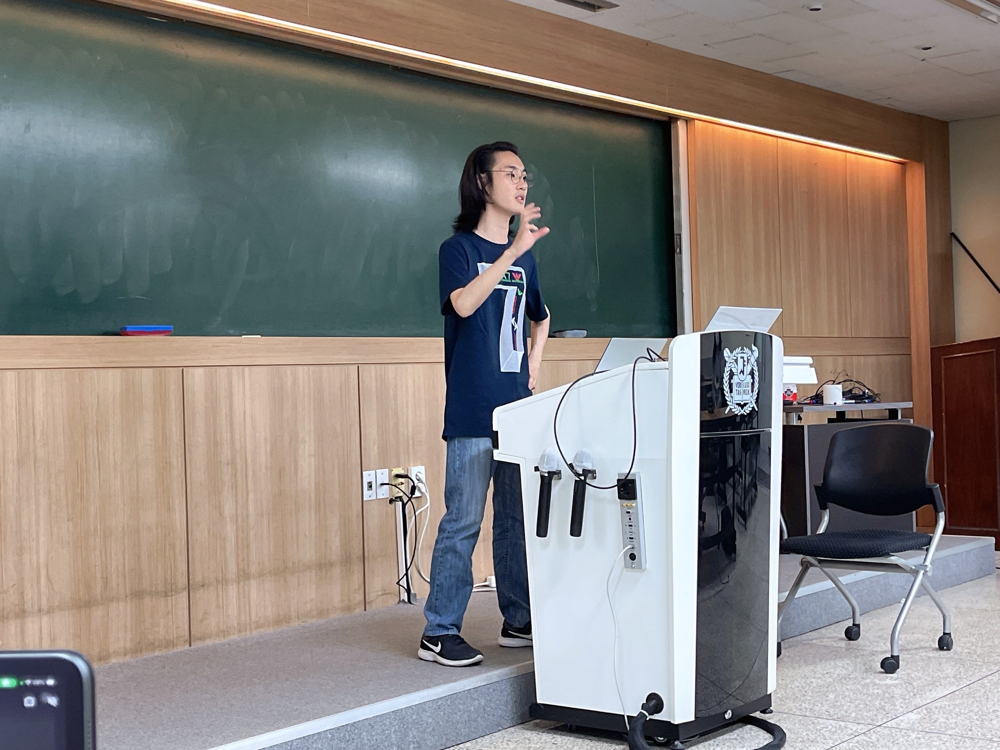

바쿠스는 회원들간의 친목 도모 및 기술 공유를 위해 매년 2번 정기적으로 세미나를 열고 있습니다. 이번년도 봄학기 세미나는 5/18에 진행하였습니다.  
코로나 중에도 세미나는 지속적으로 열렸지만, 이번 세미나는 코로나 이후 처음으로 열리는 세미나라 다들 많은 기대를 품고 모여주셨습니다.    
세미나를 진행하기 전에는 다 같이 모여서 저녁으로 치킨을 먹었습니다.
이후 세미나는 301동 203호에서 오후 7시부터 9시까지 진행되었고, 총 세 분의 발표가 있었습니다.  

   

#### 하스켈 한 스푼 (박재현)
첫 번째 발표는 박재현 님의 Haskell에 대한 발표였습니다. 박재현 님은 바쿠스에서 대표 및 부대표를 한 적이 있으시며, 이전에 Devsisters에서 쿠키런 서버 엔지니어로 근무하셨고 현재 인프라팀 DevOps 엔지니어로 근무중이십니다. 이번 발표에서는 Haskell이라는 언어를 공부하시고 느낀 특징들을 중심으로 발표해 주셨습니다. Haskell은 함수형 프로그래밍 언어입니다. Haskell은 세가지 특징(불변성, 통제된 가변성, 강력한 동시성)을 가지고 있다고 설명해 주셨습니다. 이런 장점들이 있어 충분히 사용할 만하지만 단점도 있습니다. 대표적인 단점으로 Laziness, Char 배열로 구현되는 String, 툴링에서의 아쉬움 등을 제시해 주셨습니다. 이런 것들을 공부하면서, Haskell의 장점 덕분에 흥미로웠으나 몇몇 단점들 때문에 사용하기 힘들다는 의견을 주셨습니다. Haskell에 대한 전반적인 개념과 느낌을 배울 수 있는 발표였습니다.

#### Introduction to Game Server Development (이강욱)
두 번째 발표는, 이강욱 님의 게임 서버 제작 및 배포에 대한 발표였습니다. 이강욱 님은 이전에 Spoqa에서 풀스택 프로그래머로 근무하신 적이 있으며, 현재 Devsisters에서 DevOps Engineer로 근무하고 계십니다.  
그 경력을 살려 이번 발표에서는 게임 서버 개발에 있어서 마중물 역할을 해줄 수 있는 키워드들을 제시해 주셨습니다.  
처음에는 Unity에서 제공하는 Mirror Networking에 대해 설명해 주셨습니다. Mirror Networking을 사용하면 기존에 작성한 클라이언트의 코드를 그대로 사용하여 서버를 만들 수 있습니다. 하지만 생각만큼 간단하지는 않았다고 하셨습니다.  
그 이후에는 비 실시간 게임 서버와 관련하여 container를 사용할 수 있음을 이야기 해 주셨습니다. 다음으로 실시간 게임 서버를 어떻게 배포하는지 설명하셨습니다. 그 방법으로 Kubernetes와 Agones를 말씀해 주셨고, 각각에 대한 설명이 있었습니다. 
이 발표를 통해서 게임 서버 개발에 관심이 있지만 처음해보시는 분들에게 도움이 되는 키워드들을 재공할 수 있었으면 좋겠다고 하셨습니다.

#### Nix를 아십니까 (성용운)
세 번째 발표는, 성용운 님의 NixOS에 대한 발표였습니다. Linux의 대표 배포판인 Debian, Ubuntu와는 다르게 NixOS는 자체적으로 제공하는 기본 설정파일 하나만으로 쉽게 서버를 올릴 수 있는 장점이 있음을 설명해 주셨습니다. 그에 대한 데모로 마인크래프트 서버를 NixOS에서 어떻게 올릴 수 있는지 시연을 하셨습니다. NixOS는 빌드 시에 캐시가 없어 느리고 파일이 크다는 점 등 단점도 제시해 주셨습니다. 그럼에도 불구하고, root 권한이 필요 없고, global하게 설정을 하지 않아도 세팅이 가능한 장점이 있어 필요한 프로그램의 설치 및 제거가 용이하기 때문에 그런 점에서는 사용을 추천한다고 하셨습니다.  

#### 질문과 답변
이번 발표자 분들 중에서 데브시스터즈에 근무하고 계시는 분들이 계셔서 그 회사에서는 어떻게 개발을 진행하고 있는지에 대한 질문을 주로 많이 해주셨습니다.
 - 데브시스터즈에서 어떤 언어를 사용하는지에 대한 질문이 있었습니다. 이에 대하여 Go, Scala 등을 사용한다고 답변해주셨습니다.
 - 데브시스터즈는 게임서버 개발을 어떻게 하고 있나라는 질문이 있었습니다. infra팀과 게임개발자가 분리되어 있어서, infra팀에서 게임 개발자들에게 서버를 쉽게 만들 수 있게 api를 제공해준다고 하셨습니다.  
 Haskell을 사용할 때 마주칠 수 있는 concurrency에 관련된 질문도 있었습니다.
 - '가변성이 있는 자료구조가 있다면 Haskell의 concurrency 구현에서 race condition이 발생할 위험이 있지 않은가?' 라는 질문에 대하여 '가변 타입과 동시성 자료 타입이 구분되어 있기 때문에 문제가 없다'라고 답변해주셨습니다.

   

#### 마치며
주기적으로 열리는 세미나에서 다 같이 기술 공유를 할 수 있어서 좋았고, 회원들이 적극적으로 많이 참여해주셔서 세미나를 잘 마무리할 수 있었습니다. 충분한 시간이 없어 조금 더 기술 공유를 하지 못했던 아쉬움도 남았습니다.
또한 세미나와 같이 회원들이 생각이나 지식을 공유할 수 있는 자리가 더 많이 있었으면 좋겠다라는 의견도 나왔습니다. 
바쿠스 회원분들 중 발표자료를 다시 보고 싶으신 분들은 바쿠스 구글 공유 폴더(2023>5-18세미나)에서 확인하실 수 있습니다.
그 일환으로 6월 말에 세미나를 추가 진행하기로 하였습니다. 기술에 대해 많이 몰라도 즐길 수 있는 키보드 배열에 대한 발표, 가계부를 어떻게 써야하는지에 대한 발표 등이 예정되어 있습니다.   
바쿠스 세미나는 기술과 그 외의 원하는 주제로 발표를 다양하게 진행하므로, 많은 사전지식이 없어도 충분히 들을 수 있다는 점이 좋았습니다. 
지금까지와 같이 앞으로도 활발한 세미나가 이루어질 수 있기를 기대합니다.  

작성자 : 정회원 류지민, 준회원 김영찬