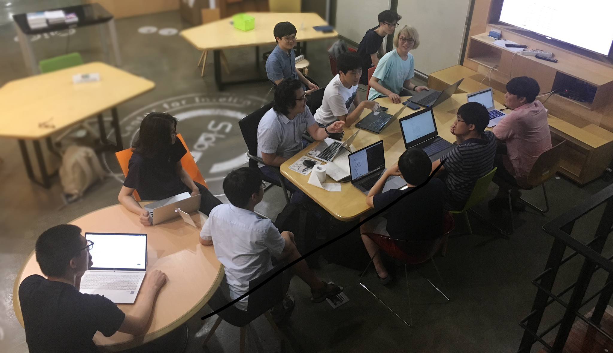
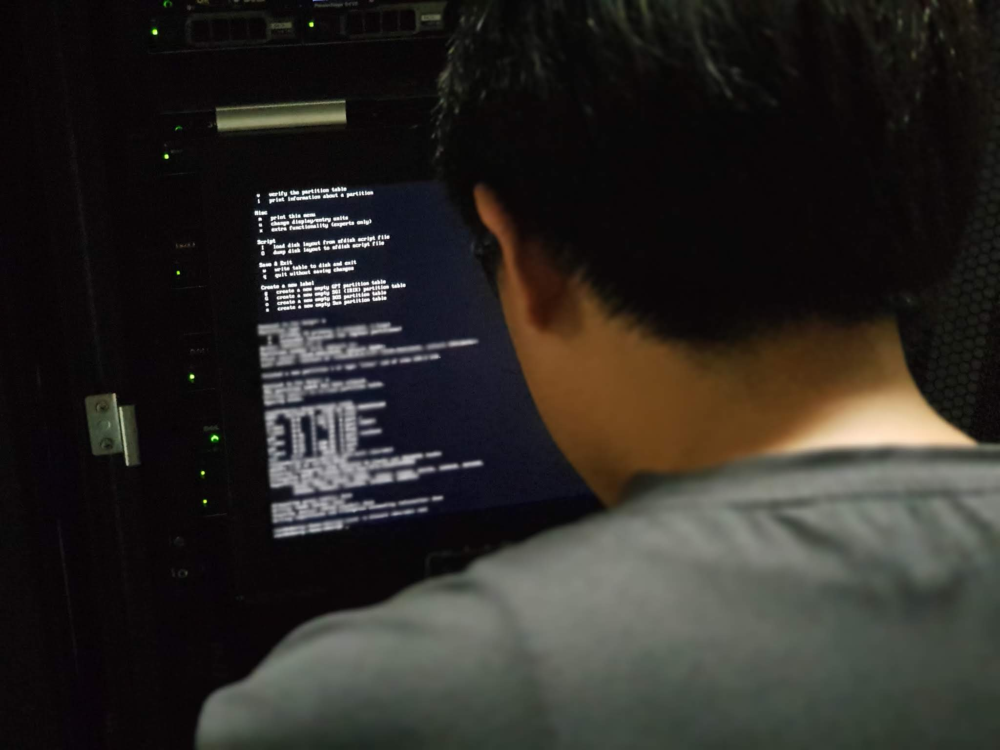

# 우리는 SNUCSE 관리자 동아리, 바쿠스입니다!

**바쿠스**는 SNUCSE 내의 컴퓨터와 네트워크 환경을 유지보수 및 개선하기 위한 학생 동아리입니다.

 ## 주요 활동 목록

 강의를 위한 가상 서버(VM)를 발급하거나, 학생들의 실습을 위한 Linux 머신과 GPU 머신 등을 서비스하고 관리하는 등의 활동으로 컴퓨터공학부 수업을 듣는 학생들이 쾌적한 환경에서 공부할 수 있도록 합니다.

* 통합계정 서비스 제공
* 강의용 실습 계정 및 가상 서버(VM) 발급
* 중요한 자료들의 주기적 백업 실시 
* 하드웨어 실습실 & 과방 OS 재설치
* 실습 서버 martini / mimosa 의 제공
* 하드웨어 실습실 컴퓨터와 과방 컴퓨터 간 홈 디렉토리 연동
* bacchus-lounge IRC 클라이언트 서비스
* ML 실습용 GPU 서버 제공
* 학생들의 편의 및 학습을 위한 서비스 개발 및 적용
* 학부 커뮤니티 서비스 [SNUCSE](https://www.snucse.org) 관리
* 학부 홈페이지 [cse.snu.ac.kr](https://cse.snu.ac.kr) 관리

## 어떻게 활동하나요

### 학기 중

* 학기 중에는 시험기간을 제외하고 일주일에 1번씩 회원들이 모여 회의하는 시간을 갖습니다. 회의에서는 다음 일주일 동안 처리해야 할 이슈들을 서로 의논하고 작업 분담을 하여 업무가 원활하게 이루어질 수 있도록 합니다.

* 신입 회원의 경우 업무에 기여할 능력이 부족한 상태인 경우가 다수이므로, 경험 많은 정회원들이 신입회원들을 대상으로 Linux 운영체제를 이용한 서버 관리를 가르칩니다.

### 방학 중

* 방학 중에는 강의가 많지 않은 틈을 타서 과방과 하드웨어 실습실에 있는 컴퓨터들의 재설치를 진행합니다. 운영체제 버전이 업데이트 된 경우 새로운 버전으로 업그레이드도 동시에 진행합니다.

* 학기 중에 새로운 서비스에 대한 제안이 나왔을 경우 시간이 많은 방학 때에 TF를 꾸려 개발을 진행합니다.

### 상시

* 중요한 보안 결함 등이 발생하면 해결책을 찾고 빠른 시간 내에 대응합니다.

* 정전 등의 돌발상황이 발생할 경우, 자발적으로 인원이 투입되어 공지 및 복구작업을 진행합니다.

E-mail : contact@bacchus.snucse.org
